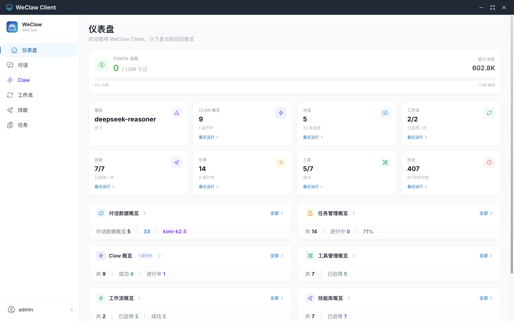
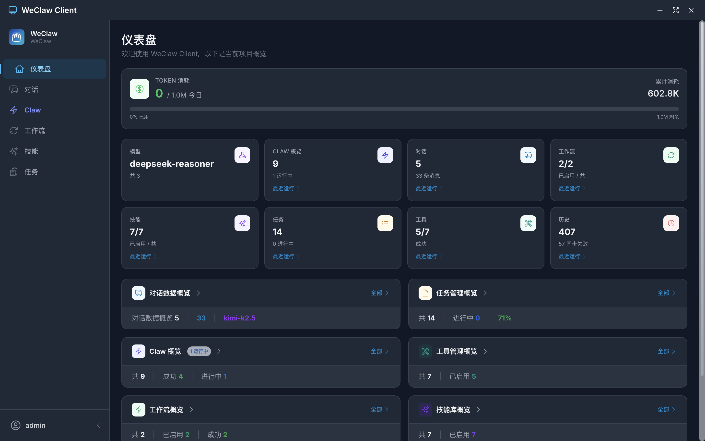

# WeClaw Client

> 跨平台 AI 助手桌面应用，集成自主 Agent 执行、智能对话、工作流自动化、技能库与工具管理于一体。

[](LICENSE)
[](https://www.electronjs.org/)
[](https://react.dev/)
[](https://www.typescriptlang.org/)

---

## 功能概览





### 🤖 Claw Agent（核心）

WeClaw 的核心特性，类 OpenClaw 架构的**自主 AI Agent**。用户只需输入一个自然语言目标，Claw 会自动：

1. **规划阶段**：调用 AI 将目标拆解为 3–8 个可执行步骤（JSON 结构化输出）
2. **执行阶段**：逐步驱动 AI 执行每个步骤，跨步骤传递上下文
3. **自动化动作**：解析 AI 输出中的代码块，自动完成文件创建和命令执行

**支持的步骤类型：**

| 类型 | 说明 |
|------|------|
| `think` | 分析、思考、规划 |
| `search` | 搜索、查找信息 |
| `write` | 写作、生成文档/内容 |
| `code` | 生成代码（自动写文件 + 执行命令）|
| `file` | 文件操作、整理（自动写文件）|
| `api` | 接口调用、数据获取 |
| `summarize` | 汇总、整合最终结果 |
| `custom` | 其他自定义操作 |

**自动化动作：**
- **`write-file`**：AI 输出中包含 ` ```write-file 路径\n内容``` ` → 自动创建文件
- **`exec-command`**：AI 输出中包含 ` ```bash\n命令``` ` → 自动在终端执行

---

### 💬 智能对话

- 多会话管理：创建、切换、删除对话，持久化存储
- 支持图片和文件附件上传（拖拽 / 粘贴）
- 快捷指令：总结、翻译、解释、写代码、优化
- 技能注入：对话时一键调用技能库中的提示词
- 输出面板：代码计划、待办清单、文件预览三合一侧边栏

---

### 🔀 工作流自动化

- 可视化画布编辑器，拖拽式节点连线
- 支持多种触发方式：手动、定时（Cron）、文件变更、API 调用、Webhook
- 丰富节点类型：AI 对话、条件分支、文件操作、代码执行、任务创建、通知、数据处理等
- 工作流版本管理与执行历史查看

---

### 🧩 技能库

- 创建、编辑、删除自定义提示词技能
- 分类管理：效率 / 编程 / 写作 / 分析 / 沟通 / 自定义
- 支持从本地 JSON 文件导入或通过 URL 导入社区分享的技能包
- 技能可注入 Claw Agent 的规划 System Prompt，影响 AI 规划策略

---

### 🔧 工具管理

- 定义 AI 可调用的工具（内置 / 脚本 / API 三种类型）
- 权限精细控制：只读 / 读写 / 禁用
- 参数化配置，支持 Shell / Python / Node.js 脚本和自定义 API
- 工具可在工作流节点中直接引用

---

### 📋 任务管理

- 看板式任务视图（待处理 / 进行中 / 已完成 / 已取消）
- 支持优先级（低 / 中 / 高 / 紧急）、负责人、截止日期、预计工时
- 标签和备注，依赖任务关联
- 任务统计总览

---

### 📊 仪表盘

- Token 消耗统计（今日 / 累计 / 剩余额度）
- 对话数、工作流数、任务数、操作记录数一览
- 各模块快速入口（工作流 / 任务 / 对话 / 历史 / 技能 / 工具）

---

### 🔑 模型配置

支持配置并切换多个 AI 模型，开箱即用支持：

| 类型 | 示例 |
|------|------|
| OpenAI 兼容 | GPT-4、自定义兼容接口 |
| DeepSeek | deepseek-chat（默认）|
| 通义千问（Qwen）| qwen-max 等 |
| 文心一言（Ernie）| ERNIE-Bot 等 |
| 讯飞星火（Spark）| spark-desk 等 |
| 智谱 AI（Zhipu）| GLM-4 等 |

---

### 🏢 工作区间

- 设置安全工作目录，所有文件操作受工作区间限制
- 路径权限检查工具，实时测试路径是否在工作区内
- 超出权限的操作自动拦截并记录

---

### 📜 操作历史

- 完整记录所有操作（对话、文件访问、权限检查、模型切换、工作区变更）
- 分页查询、关键词搜索、类型筛选
- 定时同步：支持间隔模式和 Cron 表达式，支持 Bearer Token / Basic Auth / API Key 三种认证方式
- 自动只保留最近 500 条（防止过大）

---

### 🔒 安全机制

- **文件写入黑名单**：禁止写入 `/System`、`/usr`、`/bin`、`C:\Windows` 等系统目录
- **命令执行黑名单**：拦截 `rm -rf /`、`format`、`mkfs`、Fork Bomb 等危险命令
- **工作区间隔离**：文件操作只允许在活跃工作区目录内执行
- **数据本地存储**：所有配置和历史记录存储在本地 JSON，不上传云端
- **API 密钥**：配置安全存储在本地

---

## 技术栈

| 层次 | 技术 |
|------|------|
| 桌面框架 | Electron 25 |
| 前端框架 | React 18 + TypeScript 5 |
| 样式方案 | Tailwind CSS 3 + Headless UI |
| 图标 | Heroicons |
| 路由 | React Router DOM 6 |
| Markdown 渲染 | react-markdown + remark-gfm |
| 代码高亮 | react-syntax-highlighter + Prism.js |
| 数据校验 | Zod |
| 构建工具 | Vite 4 |
| 打包 | electron-builder 24 |
| 数据存储 | 本地 JSON 文件（无需数据库）|

---

## 快速开始

### 环境要求

- Node.js >= 18
- npm >= 9

### 安装与启动

```bash
# 克隆项目
git clone <repository-url>
cd weclaw-client

# 安装依赖
npm install

# 启动开发模式（自动启动 Renderer + Electron 主进程）
npm run dev
```

### 打包发布

```bash
# macOS (.dmg)
npm run package:mac

# Windows (.exe / NSIS)
npm run package:win

# 仅构建不打包
npm run build
```

### 常用脚本

| 命令 | 说明 |
|------|------|
| `npm run dev` | 启动开发服务器 |
| `npm run build` | 构建（Renderer + Electron 主进程）|
| `npm run package:mac` | 打包 macOS 安装包 |
| `npm run package:win` | 打包 Windows 安装包 |
| `npm run lint` | 运行 ESLint 代码检查 |

---

## 项目结构

```
weclaw-client/
├── electron/                # Electron 主进程
│   ├── main.ts             # 主进程入口（IPC 处理、AI API 调用、文件操作）
│   ├── preload.js          # 预加载脚本（暴露 IPC 给渲染进程）
│   └── tsconfig.json       # Electron TS 配置
├── src/                     # 前端渲染进程
│   ├── pages/              # 页面组件
│   │   ├── Claw.tsx        # Claw Agent 页面（核心，~104KB）
│   │   ├── Chat.tsx        # AI 对话页
│   │   ├── Dashboard.tsx   # 仪表盘
│   │   ├── Tasks.tsx       # 任务管理看板
│   │   ├── WorkflowEnhanced.tsx  # 工作流画布
│   │   ├── SkillManager.tsx      # 技能库管理
│   │   ├── ToolManager.tsx       # 工具管理
│   │   ├── ModelConfig.tsx       # 模型配置
│   │   ├── WorkspaceManager.tsx  # 工作区间管理
│   │   ├── HistoryViewer.tsx     # 历史记录
│   │   ├── Settings.tsx          # 应用设置
│   │   └── Login.tsx             # 登录/注册
│   ├── components/         # 可复用组件
│   │   ├── chat/           # 对话相关组件
│   │   ├── dashboard/      # 仪表盘子组件
│   │   ├── skills/         # 技能库组件
│   │   ├── tools/          # 工具管理组件
│   │   ├── workflow/       # 工作流画布组件
│   │   └── history/        # 历史记录组件
│   ├── contexts/           # React Context（Settings / Model / Workspace / Task）
│   ├── types/              # TypeScript 类型定义（含 claw.ts Agent 类型）
│   ├── utils/              # 工具函数（storage / tokenLogger / clawStorage 等）
│   ├── App.tsx             # 应用根组件（路由配置）
│   └── main.tsx            # 渲染进程入口（含全局 ErrorBoundary）
├── dist/                   # 构建输出
├── package.json
├── vite.config.ts
└── README.md
```

---

## 使用指南

### 1. 配置 AI 模型

1. 点击侧边栏「模型」→「添加模型」
2. 填写模型名称、类型（DeepSeek / OpenAI / Qwen 等）、API 端点、API 密钥
3. 勾选「设为默认模型」后保存

### 2. 使用 Claw Agent

1. 点击侧边栏「Claw」进入 Agent 页面
2. 在输入框输入目标（例如：*帮我写一个 Python 爬虫，抓取 xxx 并保存为 CSV*）
3. 按 `Ctrl+Enter` 提交，Claw 自动规划并执行
4. 右侧面板实时查看生成的文件内容

### 3. 设置工作区间

1. 点击侧边栏「工作区」→「设置工作区间」
2. 选择本地目录，之后 Claw 创建的文件都会保存在此目录
3. 可用「权限测试工具」验证路径是否在工作区内

### 4. 管理技能

1. 点击侧边栏「技能」新建或导入技能
2. 在 Claw / 对话页面选择激活的技能，AI 会参考技能内容调整行为
3. 支持从 JSON 文件导入社区分享的技能包

### 5. 设置历史同步

1. 点击侧边栏「历史」→「定时同步」
2. 配置服务器地址和认证方式（Bearer Token / Basic Auth / API Key）
3. 设置同步间隔（分钟模式或 Cron 表达式）

---

## 国际化

支持 **简体中文（默认）** 和 **English** 两种界面语言，在「设置」→「应用程序设置」→「语言」中切换。

翻译字典内嵌于 `src/contexts/SettingsContext.tsx`，覆盖所有页面和组件的 UI 文本。

---

## 贡献指南

1. Fork 本仓库
2. 创建功能分支：`git checkout -b feature/your-feature`
3. 提交更改：`git commit -m 'feat: add your feature'`
4. 推送分支：`git push origin feature/your-feature`
5. 创建 Pull Request

---

## 许可证

[MIT License](LICENSE)

---

> **注意**：WeClaw Client 是持续迭代的项目，建议在正式使用前备份重要数据。Claw Agent 自动执行命令时请确认工作区间设置正确，避免误操作系统目录。
